# Выпускная квалификационная работа бакалавра "Транскрипция музыкального произведения с использованием вейвлет-преобразований"

[Полностью здесь](Диплом.pdf) (веселье начинается на пункте 4.2, стр 30)

## Почему именно непрерывное вейвлет-преобразование (НВП)?

Большинство музыкальных инструментов позволяют получить амплитудно-временные характеристики нот с помошщью масштабирования такой характеристики одной заданной ноты:

%20=%20N_0%20\left%20(t%20\over%20{modifier_{scale}%20}\right))

Для большинства инструментов характерен равномерно-темперированный строй, то есть коэффициенты  обычно равны  где . Например, если рассматривать ноту "до" первой октавы как базовую ), то характеристика ноты "до" следующей октавы может представлена как =%20N_0%20\left%20(t%20\over%20{2^{12/12}}%20\right)). Также достоин внимания следующий факт: в качестве базовой ноты может быть выбрана любая нота из диапазона инструмента.

Суть непрерывного вейвлет-преобразования заключается в том, чтобы выбрать материнский вейвлет – короткую функцию, составить по нему семейство вейвлетов с помощью сдвигов по времени и масштабирования материнского вейвлета.

Это схоже с формирование семейств нот из одной базовой путем сдвига времени начала ноты и ее масштабирования.

По своему принципу непрерывное вейвлет-преобразование очень подходит данной задаче.

## Ход работы

1.	Разработка алгоритма непрерывного вейвлет-преобразования;
2.	Выбор материнского вейвлета;
3.	Создание семейства вейвлетов на основе материнского, или разработка алгоритма масштабирования материнского вейвлета;
4.	Применение алгоритма непрерывного вейвлет-преобразования;
5.	Обработка данных (фильтрация);
6.	Нахождение нотных объектов в обработанных данных и создание транскрипции.

## Как получается материнский вейвлет?
Была сыграна нота А4 в симуляторе рояля в FL Studio. Берем небольшой кусочек ее сигнала *(примерно 16 периодов, такая длина хорошо себя показывает)*, прогоняем через прямое преобразование Фурье, зануляем первый элемент, прогоняем через обратное преобразование Фурье. Результат - небольшой кусочек сигнала ноты, чей интеграл почти равен нулю (что требуется для вейвлета).

## Как получается семейство вейвлетов?
С помощью кусочно-линейной аппроксимации. 

У дочерних вейвлетов есть масштаб  - положение проверяемой ноты относительно А4(ля). Например, масштаб для проверки B4(си) будет 2, для G4(соль) -2.

Когда запрашивается дочерний вейвлет определенного масштаба, мы берем материнский вейвлет, высчитываем, во сколько раз его надо увеличить/уменьшить, делаем это с помощью кусочно-линейной аппроксимации, возвращаем полученный дочерний вейвлет.

### Как высчитываем, во сколько раз увеличить/уменьшить? 
Частота нашей базовой ноты А4 - 440 Гц. Допустим, нам нужен дочерний вейвлет для А5, которая находится ровно на одну октаву выше А4. Ее частота вдвое выше А4 и составляет 880 Гц. Значит, уменьшаем материнский вейвлет в 2 раза. В нем так же будет 16 периодов, но частота изменится в 2 раза.

, где *scale* - положение относительно базовой ноты.

*Длина дочернего вейвлета = длина материнского вейвлета* * 

## Алгоритм НВП
Изначально пользователем задается промежуток нот, существование которых требуется проверить в сигнале (в примерах рассматривается промежуток в 3 или 4 октавы - 36 или 48 нот).

Для каждой ноты из списка, генерируем дочерний вейвлет , где *scale* - положение относительно базовой ноты. 

Производим [взаимную корреляцию](https://docs.scipy.org/doc/scipy/reference/generated/scipy.signal.correlate.html) исходного сигнала (музыкального файла) и дочернего вейвлета, затем домножаем на . Получаем результат вейвлет-преобразования, записываем в строку в двумерный массив. Повторяем для каждой ноты из списка.

В итоге получается что-то вроде

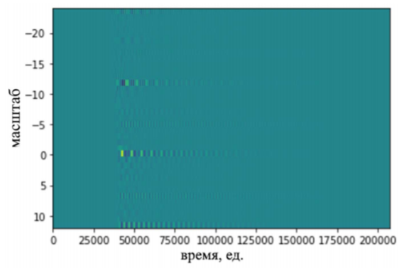

С помощью фильтров, оно превращается в

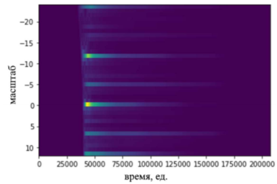

А затем в

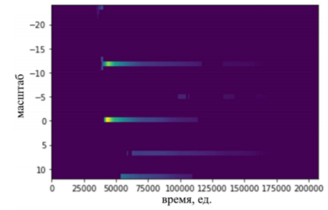

Чем желтее зона, тем сильнее отклик НВП с дочерним вейвлетом данного масштаба в данный момент времени.

В исходном сигнале была сыграна октава А3 и А4. Здесь это вполне видно (масштабы -12 и 0).

## Какие фильтры?
* взятие абсолютных значений 
* [maximum_filter1d](https://docs.scipy.org/doc/scipy/reference/generated/scipy.ndimage.maximum_filter1d.html)
* [median_filter](https://docs.scipy.org/doc/scipy/reference/generated/scipy.ndimage.median_filter.html)
* обнуление по порогу (зануляем всё, что ниже какого-то процента максимума)
* вертикально-октавный фильтр, чтобы избавиться от гармонических ошибок (ложных октав) и оставить только действительно прозвучавшие (сравниваем значения с разницей в октаву *(т.е. масштабы -24, -12, 0 и 12; -23, -11 и 1; и тд)* и оставляем только самые сильные)

## Как искать ноты?
Найдем максимальное значение во всей матрице. Пусть пороговое значение для существования потенциальной ноты равняется некоторой доли от этого значения.

Найдем максимальное значение на каждой строке. Если оно больше, чем пороговое значение для существования потенциальной ноты, то на этой строке есть потенциальная нота. Все строки с потенциальными нотами отфильтруем [maximum_filter1d](https://docs.scipy.org/doc/scipy/reference/generated/scipy.ndimage.maximum_filter1d.html) и [median_filter](https://docs.scipy.org/doc/scipy/reference/generated/scipy.ndimage.median_filter.html).

Посмотрим на отклик НВП во время звучания ноты:
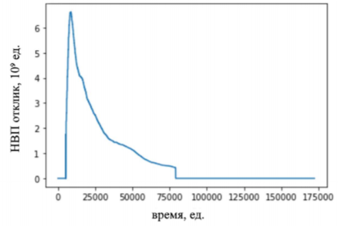

При нажатии на ноту отклик значительно повышается, затем постепенно уменьшается. Чтобы найти моменты нажатия на ноты, нужно следить за резким повышением отклика НВП.

В каждой строке с потенциальной нотой ищем ноты следующим образом: 
1. Возьмем модуль производной строки. Это даст нам разницу между
соседними элементами.
2. Фильтр обнуления по порогу: должны остаться только резкие изменения значений.
3. Находим места заметных пиков и длины между ними.

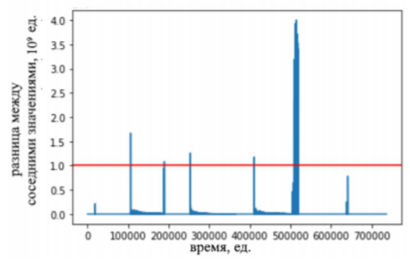

4. Фильтруем по длине до ближайшего пика: оставляем только значения больше минимальной установленной длины. Это необходимо, чтобы найти начало пика, отфильтровав все значения, которые принадлежат этому же пику. В результате получаем **места начала потенциальных нот**. Например, на предыдущем рисунке их пять.
5. Имея начала потенциальных нот на строке, можно разделить строку на промежутки: от начала одной потенциальной ноты до начала следующей (или до конца строки, если следующей ноты нет).
6. Найдем максимальный отклик в промежутке и объявим его местоположение началом ноты. Наблюдаем за уменьшением отклика НВП после этого: как только оно достигнет минимального установленного значения, объявляем это место **концом ноты**.

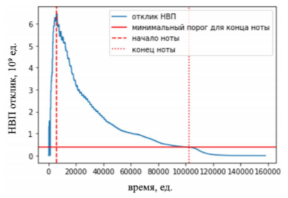

7. Если длина получившейся ноты больше установленной минимальной
длины ноты, записываем ноту.

Отобразим найденные ноты на скалограмме:

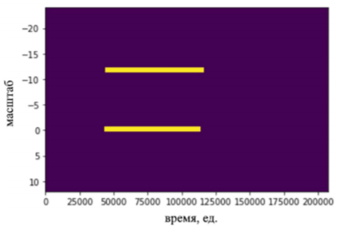

Мы получили dictionary нот и их длин. Запишем их в MIDI файл. Готово.

## Результаты
Зеленым - изначальный MIDI-файл, по которому был сгенерирован сигнал в симуляторе рояля FL Studio. Красным - MIDI-файл, полученный программой после анализа сигнала. Пояснение к результатам можно найти на [стр. 41](Диплом.pdf).

1 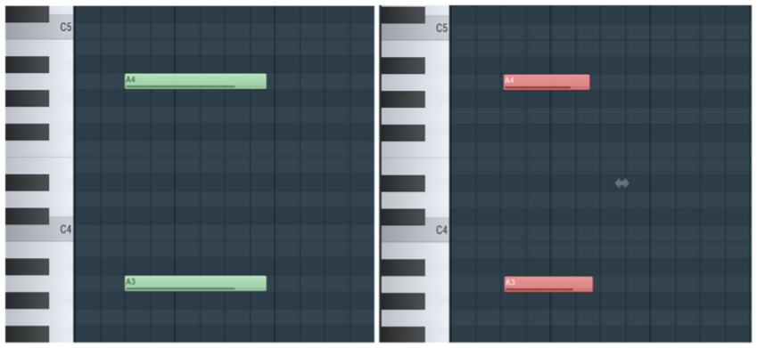

2 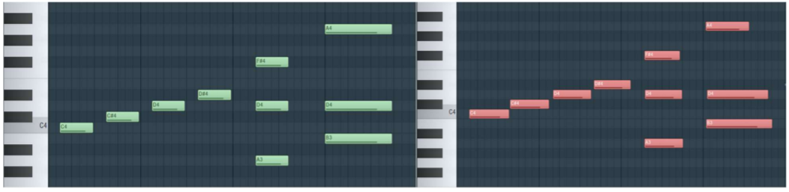

3 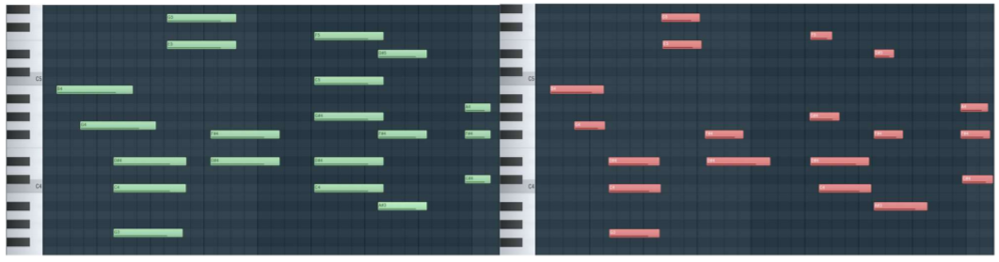

4 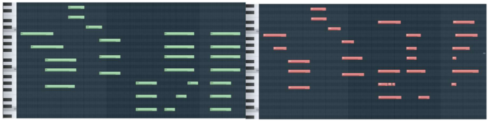

## Перспективы развития

1.	Автоматизация. В ходе работы пришлось подбирать коэффициенты для фильтров вручную, для нового сигнала часто нужны были правки. Возможно автоматизировать этот процесс с помощью нейронной сети или других методов.
2.	Расширить возможности распознавания. Добавить больше возможных музыкальных инструментов. Добавить возможность сначала записать с микрофона одну ноту, выбранную как базовую, чтобы затем записывать музыкальный сигнал с микрофона и распознавать игру этого инструмента.
3.	Добавить другие формы нотации. Сейчас доступен только MIDI-файл, но возможно добавить и нотный стан.
4.	Тестирование. Необходимо протестировать работу алгоритма на куда большем наборе данных, чтобы получить точную статистику и оценку. Сейчас это было делать нецелесообразно ввиду отсутствия автоматизации настройки коэффициентов фильтров. Так как их приходилось для каждого сигнала настраивать вручную для лучшего результата, тестирование на большем наборе данных представляется затруднительным, а статистика –  необъективной.
